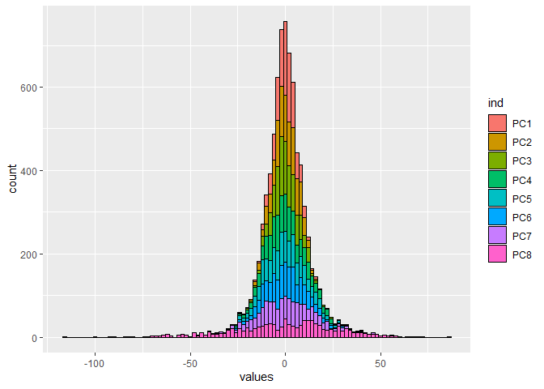
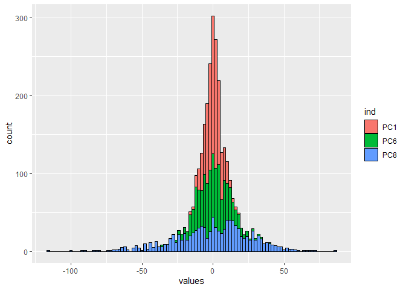

In this notebook, I will explore some aspects of principal components
analysis that are not immediately obvious and review the basics of this
method. We will use a small fabricated dataset of rent in Austin, where
our goal is to predict rent prices based on eight explanatory variables:

``` r
df = read.csv("AustinApartmentRent.csv", fileEncoding = "UTF-8-BOM")
X = df[,-1]
y = df[,1]
```

``` r
head(df)
```

    ##   Rent Area Bedrooms Bathrooms Security Parking Distance Shuttle Age
    ## 1  519  725        1         1        0       0     10.5       1   9
    ## 2  765  995        2         2        0       0      6.5       1  17
    ## 3  475  481        1         1        0       0      6.5       1  17
    ## 4  575  925        2         2        0       1      4.0       1   9
    ## 5  415  600        1         1        0       0      5.0       1  30
    ## 6  530  668        1         1        0       0      6.5       1  19

First, I will run the principal components command in R, selecting the
option to scale and center our data:

``` r
austin.pca = prcomp(X, center = TRUE, scale. = TRUE)
```

Let’s be very clear about what is stored in the object that we have just
created.

First, we have what are usually refered to as the “loadings” of PCA.
This matrix of values represents the linear transformation that takes
our original data to its new space. I will refer to this matrix as *L*

``` r
L = austin.pca$rotation
L
```

    ##                 PC1        PC2       PC3       PC4       PC5       PC6
    ## Area       0.585311 -0.0410293  0.071530  0.068055 -0.068786  0.306728
    ## Bedrooms   0.557811  0.0511387  0.017507  0.213885 -0.223945  0.365049
    ## Bathrooms  0.531719 -0.0089699  0.098242  0.078655  0.154635 -0.765108
    ## Security  -0.026968 -0.6394900  0.181997 -0.229136 -0.575143  0.034806
    ## Parking    0.229787  0.0948261 -0.119137 -0.841615  0.342038  0.212962
    ## Distance  -0.095461  0.1787124  0.712584  0.209221  0.309049  0.293231
    ## Shuttle    0.019668 -0.3816067 -0.563636  0.369681  0.413989  0.230631
    ## Age       -0.022467  0.6325502 -0.334884  0.046667 -0.454454  0.039086
    ##                  PC7       PC8
    ## Area      -0.0058366  0.739684
    ## Bedrooms   0.2441492 -0.630205
    ## Bathrooms -0.2833152 -0.108568
    ## Security  -0.4074434 -0.081782
    ## Parking   -0.1793672 -0.145534
    ## Distance  -0.4648192 -0.099232
    ## Shuttle   -0.4113293 -0.076622
    ## Age       -0.5259830  0.018337

We also have the transformed data itself, which I refer to as P:

``` r
P = austin.pca$x
head(P)
```

    ##          PC1       PC2      PC3      PC4      PC5       PC6      PC7
    ## [1,] -1.2267 -0.022926  1.87579  0.86879  1.63108  0.806210 -0.68146
    ## [2,]  1.6125  0.199470  0.18827  0.97408  0.41322 -0.752724 -0.43645
    ## [3,] -1.6118  0.236145 -0.21203  0.35499  0.51348 -0.152482 -0.11222
    ## [4,]  2.2776 -0.413837 -0.89040 -1.85563  1.43485 -0.690770  0.25717
    ## [5,] -1.2780  1.096197 -1.35575  0.28012 -0.53876 -0.197212 -0.56770
    ## [6,] -1.1675  0.364283 -0.24158  0.41909  0.34587  0.093196 -0.24949
    ##             PC8
    ## [1,]  0.0140261
    ## [2,] -0.0310040
    ## [3,] -0.4758023
    ## [4,] -0.5408935
    ## [5,]  0.0037877
    ## [6,]  0.0974940

This is our data, now transformed into a new coordinate system by the
above loadings. With the loadings and our original data, we can perform
this calculation manually:

``` r
head(as.matrix(scale(X)) %*% L)
```

    ##          PC1       PC2      PC3      PC4      PC5       PC6      PC7
    ## [1,] -1.2267 -0.022926  1.87579  0.86879  1.63108  0.806210 -0.68146
    ## [2,]  1.6125  0.199470  0.18827  0.97408  0.41322 -0.752724 -0.43645
    ## [3,] -1.6118  0.236145 -0.21203  0.35499  0.51348 -0.152482 -0.11222
    ## [4,]  2.2776 -0.413837 -0.89040 -1.85563  1.43485 -0.690770  0.25717
    ## [5,] -1.2780  1.096197 -1.35575  0.28012 -0.53876 -0.197212 -0.56770
    ## [6,] -1.1675  0.364283 -0.24158  0.41909  0.34587  0.093196 -0.24949
    ##             PC8
    ## [1,]  0.0140261
    ## [2,] -0.0310040
    ## [3,] -0.4758023
    ## [4,] -0.5408935
    ## [5,]  0.0037877
    ## [6,]  0.0974940

What is special about this particular transformation is that is
orthonormal, meaning it preserves all lengths and angles (i.e. the inner
product) and more specifically, maximizes the variance among each
principal component. We can visualize this by comparing the correlation
matrix of our original data with our tansformed principal components.

``` r
X.scale = scale(X)
round(cor(X.scale), digits = 5)
```

    ##               Area Bedrooms Bathrooms Security  Parking Distance  Shuttle
    ## Area       1.00000  0.85959   0.72787  0.02549  0.26884 -0.05888  0.02325
    ## Bedrooms   0.85959  1.00000   0.65614 -0.07261  0.12736 -0.09617  0.00910
    ## Bathrooms  0.72787  0.65614   1.00000 -0.05164  0.22646 -0.02342  0.00000
    ## Security   0.02549 -0.07261  -0.05164  1.00000 -0.04385 -0.08628  0.04385
    ## Parking    0.26884  0.12736   0.22646 -0.04385  1.00000 -0.21480 -0.13462
    ## Distance  -0.05888 -0.09617  -0.02342 -0.08628 -0.21480  1.00000 -0.43717
    ## Shuttle    0.02325  0.00910   0.00000  0.04385 -0.13462 -0.43717  1.00000
    ## Age       -0.07832  0.04920  -0.09309 -0.48575  0.02704 -0.16145 -0.13938
    ##                Age
    ## Area      -0.07832
    ## Bedrooms   0.04920
    ## Bathrooms -0.09309
    ## Security  -0.48575
    ## Parking    0.02704
    ## Distance  -0.16145
    ## Shuttle   -0.13938
    ## Age        1.00000

``` r
round(cor(P), digits = 5)
```

    ##     PC1 PC2 PC3 PC4 PC5 PC6 PC7 PC8
    ## PC1   1   0   0   0   0   0   0   0
    ## PC2   0   1   0   0   0   0   0   0
    ## PC3   0   0   1   0   0   0   0   0
    ## PC4   0   0   0   1   0   0   0   0
    ## PC5   0   0   0   0   1   0   0   0
    ## PC6   0   0   0   0   0   1   0   0
    ## PC7   0   0   0   0   0   0   1   0
    ## PC8   0   0   0   0   0   0   0   1

In the original data, there is correlation between our different
variables, as would be expected. PCA takes the original data and
“rotates” it to the point where there is no correlation between each
direction, maximizing the variance in each new coordinate. We can also
look at the sample covariance matrix to understand how much variance
each principal components contains:

$$
\\dfrac{1}{n-1}(P^TP)
$$

in R this is:

``` r
(1/59)*round(t(P) %*% P, digits = 5)
```

    ##        PC1   PC2   PC3    PC4     PC5     PC6     PC7     PC8
    ## PC1 2.5982 0.000 0.000 0.0000 0.00000 0.00000 0.00000 0.00000
    ## PC2 0.0000 1.544 0.000 0.0000 0.00000 0.00000 0.00000 0.00000
    ## PC3 0.0000 0.000 1.424 0.0000 0.00000 0.00000 0.00000 0.00000
    ## PC4 0.0000 0.000 0.000 1.0238 0.00000 0.00000 0.00000 0.00000
    ## PC5 0.0000 0.000 0.000 0.0000 0.64572 0.00000 0.00000 0.00000
    ## PC6 0.0000 0.000 0.000 0.0000 0.00000 0.34819 0.00000 0.00000
    ## PC7 0.0000 0.000 0.000 0.0000 0.00000 0.00000 0.30743 0.00000
    ## PC8 0.0000 0.000 0.000 0.0000 0.00000 0.00000 0.00000 0.10864

What we see is that our transformation has eliminated any correlation
between our considered variables, as shown by the fact that entries only
appear in the diagonals of our sample covariance matrix. In fact, these
are what our refered to as the eigenvalues of our PCA, which represent
the amount of variance in each principal component:

``` r
austin.pca$sdev^2
```

    ## [1] 2.59819 1.54398 1.42404 1.02382 0.64572 0.34819 0.30743 0.10864

Since these are the elements of the diagonal covariance matrix, we can
see that these eigenvalues are also equal to the amount of variance in
each principal component, which are ordered by decreasing variance.

With all this in mind, we can now look at regression using these
principal components:

``` r
data  = as.data.frame(cbind(y, austin.pca$x))
model.pca.full = lm(y ~ ., data = data)
summary(model.pca.full)
```

    ## 
    ## Call:
    ## lm(formula = y ~ ., data = data)
    ## 
    ## Residuals:
    ##     Min      1Q  Median      3Q     Max 
    ## -164.32  -44.29    6.88   42.54  121.34 
    ## 
    ## Coefficients:
    ##             Estimate Std. Error t value            Pr(>|t|)    
    ## (Intercept)   572.27       8.31   68.89 <0.0000000000000002 ***
    ## PC1            75.07       5.20   14.44 <0.0000000000000002 ***
    ## PC2            -7.75       6.74   -1.15              0.2554    
    ## PC3             2.44       7.02    0.35              0.7292    
    ## PC4            21.48       8.28    2.59              0.0123 *  
    ## PC5            -3.13      10.43   -0.30              0.7653    
    ## PC6            -4.32      14.20   -0.30              0.7624    
    ## PC7           -24.38      15.11   -1.61              0.1128    
    ## PC8            83.44      25.42    3.28              0.0019 ** 
    ## ---
    ## Signif. codes:  0 '***' 0.001 '**' 0.01 '*' 0.05 '.' 0.1 ' ' 1
    ## 
    ## Residual standard error: 64.3 on 51 degrees of freedom
    ## Multiple R-squared:  0.819,  Adjusted R-squared:  0.79 
    ## F-statistic: 28.8 on 8 and 51 DF,  p-value: 0.000000000000000238

Notice that our standard errors of the coefficients of this regression
are strictly increasing. This is because:

$$
\\widehat{\\operatorname{var}}(\\hat{\\beta}) = s^2(X^TX)^{-1}
$$

where s is the standard error of our residuals. In the case of principal
components, we saw that the term *X*<sup>*T*</sup>*X* is equal to
exactly the diagonal matrix of eigenvalues multiplied by (n-1):

$$
\\widehat{\\operatorname{var}}(\\hat{\\beta}) = s^2
  \\begin{bmatrix}
    (n-1)\\lambda\_{1} & & \\\\
    & \\ddots & \\\\
    & & (n-1)\\lambda\_{j}
  \\end{bmatrix}^{-1}
$$
Simplifying:

$$
\\widehat{\\operatorname{var}}(\\hat{\\beta}) =
  \\begin{bmatrix}
    \\dfrac{s^2}{(n-1)\\lambda\_{1}} & & \\\\
    & \\ddots & \\\\
    & & \\dfrac{s^2}{(n-1)\\lambda\_{j}}
  \\end{bmatrix}
$$

recalling that

*λ*<sub>1</sub> ≥ … ≥ *λ*<sub>*j*</sub>

we can see that each successive variance is increasing, thus explaining
why the variance of coefficients is increasing in our regression. It is
interesting to note that this is independent of the response variable!

We could alternatively note that:

$$
\\widehat{\\operatorname{var}}(\\hat{\\beta}\_j) = \\frac{s^2}{(n-1)\\widehat{\\operatorname{var}}(X\_j)}\\cdot \\frac{1}{1-R\_j^2}
$$

where *R*<sub>*J*</sub><sup>2</sup> is the is the multiple
*R*<sup>2</sup> for the regression of *X*<sub>*j*</sub> on the other
covariates. However, we already established that the variance of each
principal component is its corresponding eigenvalue, and that this
*R*<sup>2</sup> value is zero. So we have:

$$
\\widehat{\\operatorname{var}}(\\hat{\\beta}\_j) = \\frac{s^2}{(n-1)\\lambda\_j}
$$

We can compute this in R:

``` r
sum = summary(model.pca.full)
s = sum$sigma
eigenvalues = austin.pca$sdev^2
```

``` r
sqrt(s^2/(59*eigenvalues))
```

    ## [1]  5.1973  6.7420  7.0202  8.2794 10.4253 14.1971 15.1092 25.4167

And see that we get the same standard errors that R calculated in the
above regression:

``` r
sum$coefficients[-1,2]
```

    ##     PC1     PC2     PC3     PC4     PC5     PC6     PC7     PC8 
    ##  5.1973  6.7420  7.0202  8.2794 10.4253 14.1971 15.1092 25.4167

Finally, we can graphically view how these differing variances of our
coefficients appear in a simulation. Below I have have 1000 random
samples of our data:

``` r
model.pca.full.coef = matrix(data = 0, nrow = 1000, ncol = 8)


for (i in 1:1000){
  sample  = sample(1:60, 40)
  model.pca.full.coef[i,] = as.numeric(summary(lm(y ~ ., data = data[sample,]))$coefficients[-1,1])

}
```

Below I plot a histogram of our esimate of each coefficient for each of
our simulations, centering the data so that we can compare:

``` r
model.pca.full.coef = as.data.frame(model.pca.full.coef)
colnames(model.pca.full.coef) = paste("PC", 1:8, sep = "")

library(ggplot2)
pca.center = as.data.frame(apply(model.pca.full.coef, 2, scale, scale = FALSE, center = TRUE))
ggplot(stack(pca.center), aes(x=values, fill = ind))+ geom_histogram(binwidth = 2, color = "black")
```



We see the expected result, that as we look at each successive
coefficient of our principal components that we observe a higher
varience for our estimate.

For what may be a more clear picture, we can compare PC1, PC6, and PC8:

``` r
ggplot(stack(pca.center)[c(1:1000, 5001:6000, 7001:8000),], aes(x=values, fill = ind))+ geom_histogram(binwidth = 2, color = "black")
```


